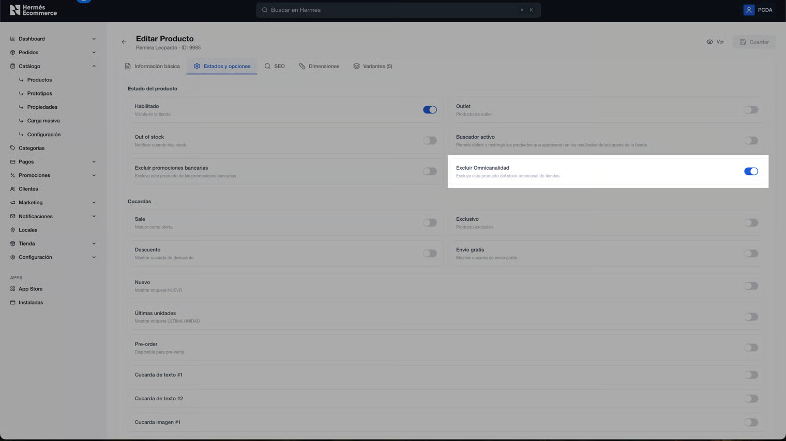

# Excluír omnicanalidad

Permite definir a nivel ítem, si el stock de locales físicos se utiliza o no para la venta online.

<figure><figcaption></figcaption></figure>


Consideraciones

* La configuración es **por ítem** (impacta a todas sus variantes)
* Convive con la configuración general de omnicanalidad.&#x20;
* Si están activos tanto el toggle del local “Local omnicanal” como “Excluir omnicanalidad”, prevalecerá la configuración definida del ítem.
* Aplica únicamente sobre el uso de stock, no modifica reglas logísticas


#### **Activación de la funcionalidad**

1. Ingresar a **App Store**
2. Ir a la pestaña **Custom**
3. Buscar la app **“Omni por producto”**

<figure><figcaption></figcaption></figure>

4. Hacer click en **“Instalar app”**

#### **Configuración por producto**

1. Ir a **Catálogo > Productos**
2. Ingresar al producto a configurar
3. En la sección **Estados y opciones**, ubicar el toggle "Excluír omnicanalidad"

<figure><figcaption></figcaption></figure>

4. Definir comportamiento:

* **Activo** → incluye stock de locales en la venta online
* **Inactivo** → no incluye stock de locales (solo central)

#### **Lógica de uso del stock**

**Toggle activo:** Se contempla el stock de:

* Locales
* Depósito central (si existe)

**Toggle inactivo:**

* Se ignora el stock de locales
* Solo se considera stock del depósito central

### **Configuración masiva por CSV**

Se puede actualizar el toggle de forma masiva mediante archivo `.csv`. Consultá el módulo "Actualización masiva de productos (CSV)" para más información.&#x20;

