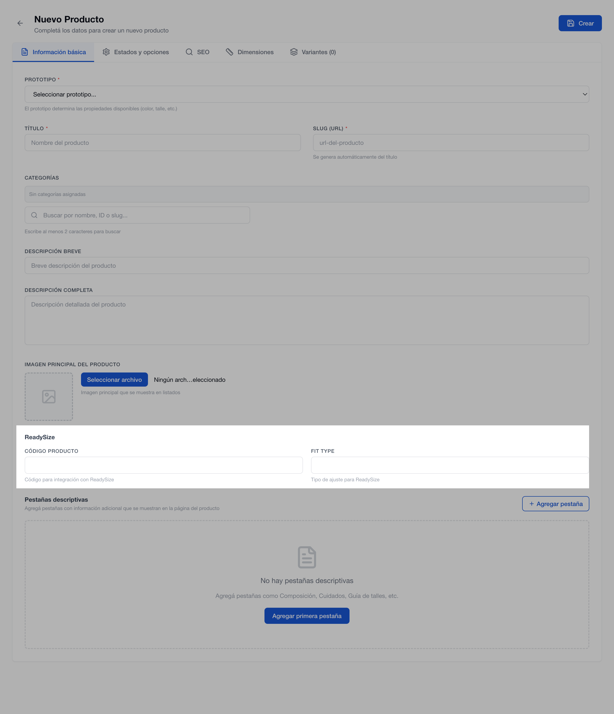

# ReadySize

**Ready Size** es una herramienta que ayuda a los usuarios a elegir el talle adecuado de una prenda en función de sus medidas corporales, reduciendo cambios y mejorando la experiencia de compra.

#### ¿Cómo funciona?

1. **Ingreso de medidas**\
   El usuario completa sus datos corporales, como busto, cintura, cadera, altura y otros parámetros relevantes.
2. **Algoritmo de recomendación**\
   La herramienta compara las medidas ingresadas con las tablas de talles configuradas para cada marca o producto y sugiere el talle más adecuado.
3. **Personalización**\
   Permite contemplar preferencias de calce, como un ajuste más suelto o más entallado, afinando la recomendación.


Esta funcionalidad no es nativa de Hermes, para activarla comunicate con tu CX asignado o enviar un formulario.


### Activación manual

En la plataforma de ReadySize, cargar las tablas de talles brindadas por ReadySize.

1. Ingresar al ítem > Información básica
2.  Cargar la información en los campos de "ReadySize"

    1. Código Producto: Lo provee ReadySize
    2. Fitsize: el número correspondiente al calce del producto, siendo:
       * 1 = regular
       * 2 = ajustado
       * 3 = holgado

    <figure><figcaption></figcaption></figure>

3. Guardar los cambios.&#x20;


Es posible activar la funcionalidad en los productos masivamente. Consultá "Actualización de productos masiva (CSV)" para más información.&#x20;


