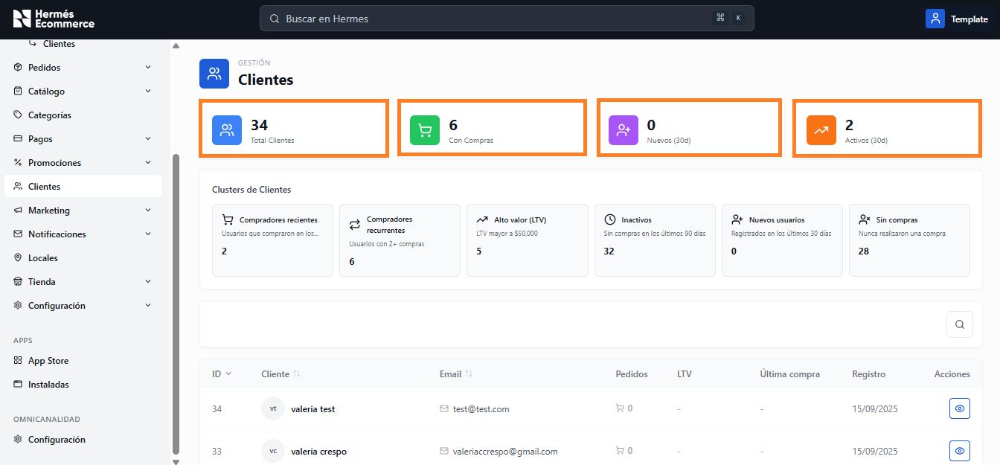
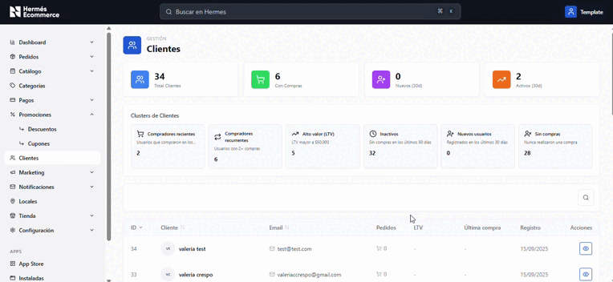
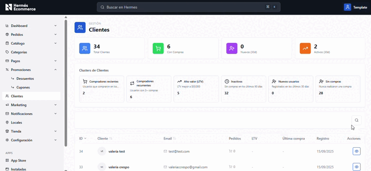

# Clientes

**URL:** `/admin/usuarios`

Gestión integral de la base de clientes del e-commerce con segmentación y métricas.

<figure><figcaption></figcaption></figure>

## Tarjetas de resumen

Vista resumen con los 4 indicadores principales del total de clientes, con compras, nuevos y activos.

<figure><figcaption></figcaption></figure>

| Métrica            | Color   | Descripción                                    |
| ------------------ | ------- | ---------------------------------------------- |
| **Total Clientes** | Azul    | Cantidad total de clientes registrados         |
| **Con Compras**    | Verde   | Clientes que han realizado al menos una compra |
| **Nuevos (30d)**   | Naranja | Nuevos registros en los ultimos 30 dias        |
| **Activos (30d)**  | Rojo    | Clientes con actividad reciente                |

## Clústers de Clientes (tarjetas interactivas)

<figure><figcaption></figcaption></figure>

| Cluster                 | Descripcion                                   |
| ----------------------- | --------------------------------------------- |
| Compradores recientes   | Usuarios que compraron en los últimos 30 días |
| Compradores recurrentes | Usuarios con 2+ compras                       |
| Alto valor (LTV)        | LTV mayor a $50.000                           |
| Inactivos               | Sin compras en los ultimos 90 días            |
| Nuevos usuarios         | Registrados en los ultimos 30 días            |
| Sin compras             | Nunca realizaron una compra                   |

## Barra de búsqueda

Ícono de lupa para buscar por nombre o email.

<figure><figcaption></figcaption></figure>

## Columnas de la tabla

| Columna       | Ordenable | Descripcion                                           |
| ------------- | --------- | ----------------------------------------------------- |
| ID            | Si (desc) | ID numérico del cliente                               |
| Cliente       | Si        | Avatar (iniciales) + Nombre completo                  |
| Email         | Si        | 
Dirección de email 

(con ícono)
          |
| Pedidos       | No        | 
Cantidad de pedidos 

(con ícono carrito)
 |
| LTV           | No        | Customer Lifetime Value                               |
| Última compra | No        | Fecha de la última compra                             |
| Registro      | No        | Fecha de registro                                     |
| Acciones      | No        | Ver detalle (ojo)                                     |
