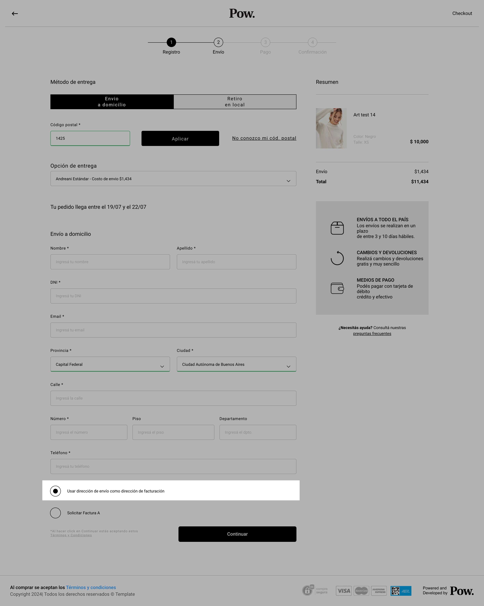

# Factura B

## Descripción&#x20;

La factura B, es la facturación realizada por defecto en Hermés. Dicha facturación no hay que solicitarla si no que se efectuará con:

1. El domicilio completado en los datos de envío (en la pantalla de shipping)
2. Se podrá también completar dicha facturación con otros datos.

Para el caso 1, en la pantalla del checkout se deberá marcar la opción que indica ¨Usar dirección de envío como dirección de facturación¨:

<figure><figcaption></figcaption></figure>

Para el caso 2, no se deberá seleccionar el bullet del caso 1:

<figure><figcaption></figcaption></figure>

Al hacer clic en continuar, se desplegará el formulario de facturación para que se complete con los nuevos datos:

<figure><figcaption></figcaption></figure>

Una vez creada la orden dentro de Hermés. En cada una de ellas, se podrán visualizar los siguientes correspondientes a la facturación solicitada. En el caso de Factura B:

* Nombre y Apellido
* Tipo de factura
* Localidad
* Estado
* Documento
* Dirección
* CP
* Nro. de Comprobante
* Telefono

<figure><figcaption></figcaption></figure>

## Visualización de Factura B en csv de órdenes

Dentro del CSV de Órdenes se verán reflejados los siguientes campos:

* Tipo de Comprobante:
  * Factura A
  * Factura B
* Número de Comprobante

