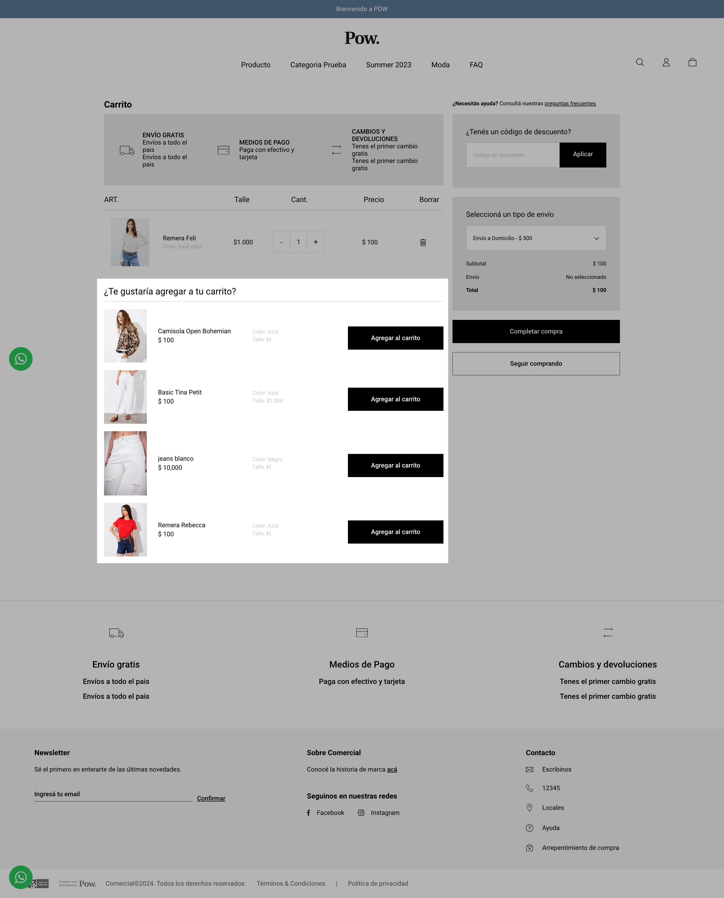

# Carrito

## Descripción

Esta configuración permite mostrar **productos recomendados** dentro del **carrito** y/o del **carrito desplegable**, tomando como base una **categoría previamente configurada**.\
Los productos que se visualizan se seleccionan de forma **aleatoria** dentro de dicha categoría.

## Configuración

1.  Ingresar a Configuración > General > Carrito.

    <figure><figcaption></figcaption></figure>
2. Seleccionar la categoría correspondiente.&#x20;
3. Marcar las opciones según dónde se deseen mostrar los productos:&#x20;
   * **Carrito y carrito desplegable:** Tildar ambos checks.
   * **Solo en el carrito:** Tildar únicamente el check **“Carrito”**.
   * **Solo en el carrito desplegable:** Tildar únicamente el check **“Carrito desplegable”**.


Pow Tip:

* Se recomienda configurar una categoría que contenga más de 4 productos, ya que, en categorías con pocos ítems, los productos sugeridos pueden repetirse con frecuencia.


4. Al finalizar, seleccionar “Guardar” para guardar los cambios.

## Visualización en el front

En el front del sitio se visualiza debajo del carrito armado por el cliente, de la siguiente manera:

* En el carrito:

<figure><figcaption></figcaption></figure>

* En carrito desplegable:

<figure><figcaption></figcaption></figure>

