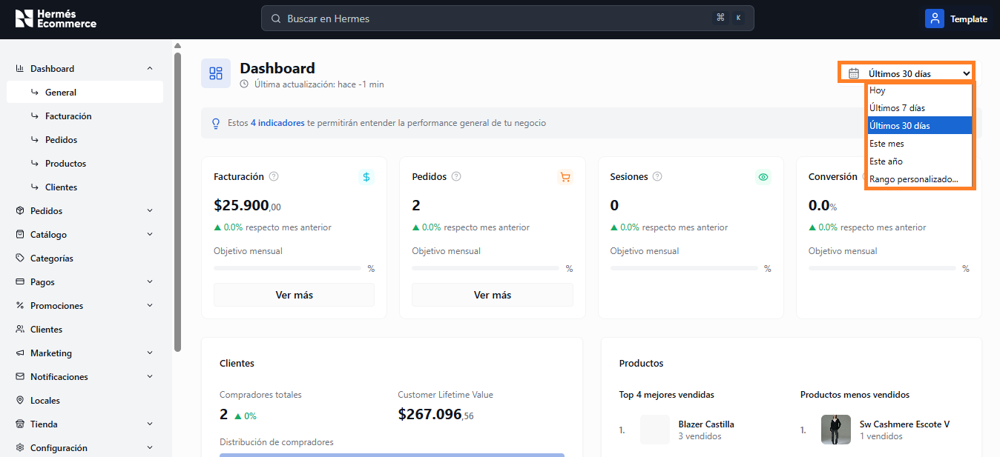
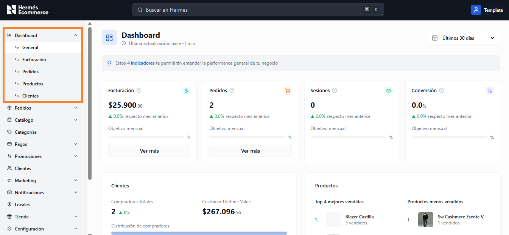

# Dashboard

El Dashboard es la pantalla principal del panel de administración.&#x20;

Ofrece una vista general del rendimiento del negocio con métricas clave, comparativas mensuales y anuales, y acceso rápido a secciones detalladas.

**URL:** `/admin/dashboard`

<figure><figcaption></figcaption></figure>

## Filtro de período

Todas las vistas del Dashboard cuentan con un selector de período temporal en la esquina superior derecha. Por defecto muestra "Últimos 30 días" pero puede cambiarse a otros rangos.

<figure><figcaption></figcaption></figure>

## Sub-secciones

El Dashboard se divide en 5 vistas accesibles desde el menú lateral:

<figure><figcaption></figcaption></figure>

| Vista                         | Descripcion                                                  |
| ----------------------------- | ------------------------------------------------------------ |
| [General](general.md)         | Resumen con los 4 KPIs principales + clientes + productos    |
| [Facturación](facturacion.md) | Análisis detallado de ventas, ticket promedio y distribución |
| [Pedidos](pedidos.md)         | Evolución y distribución de pedidos                          |
| [Productos](productos.md)     | Productos vendidos, stock y rankings                         |
| [Clientes](clientes.md)       | Segmentación, LTV y top clientes                             |

