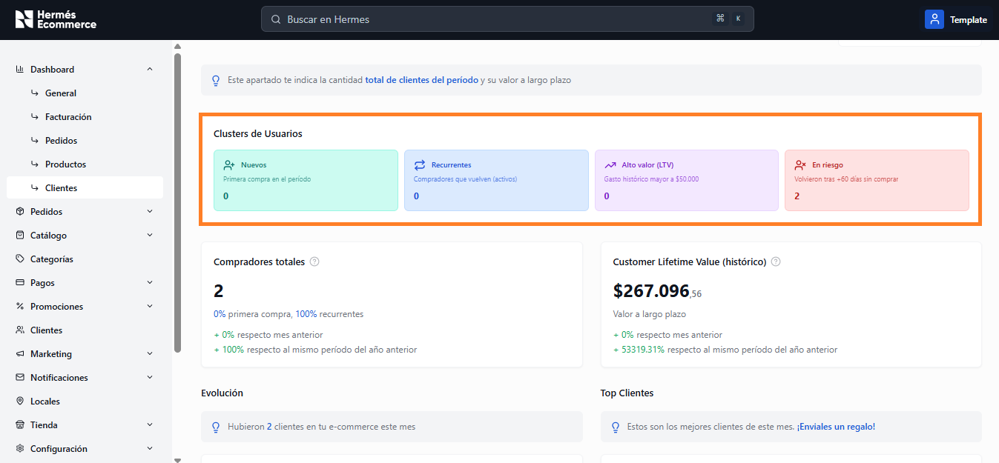
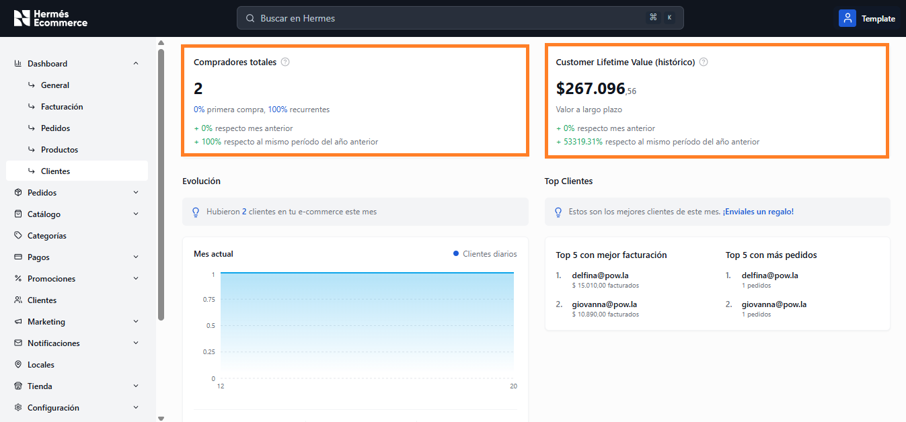
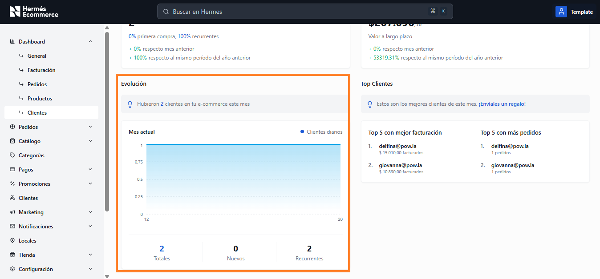
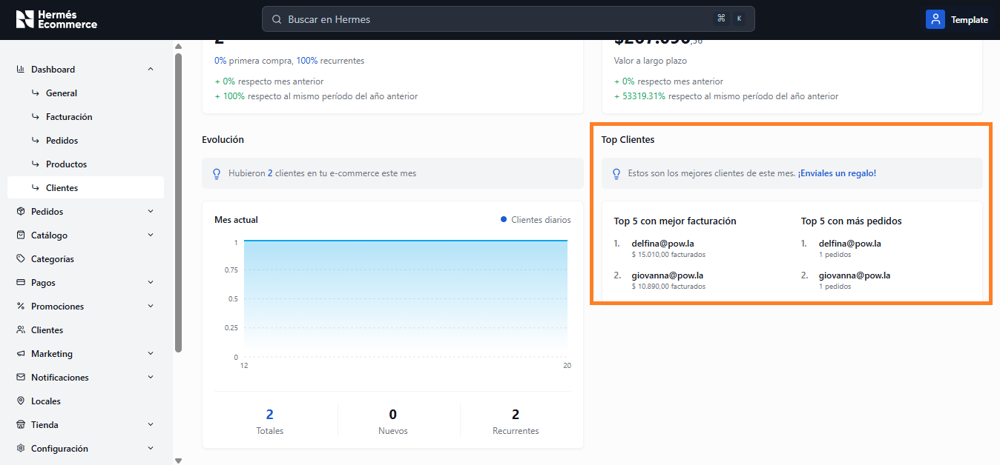

# Clientes

**URL:** `/admin/dashboard/clientes`

Análisis de la base de clientes con segmentación por clústers, valor de vida y rankings.

<figure><figcaption></figcaption></figure>

## Clústers de Usuarios

4 tarjetas superiores que segmentan la base de clientes con sus respectivas cantidades:

<figure><figcaption></figcaption></figure>

| Cluster              | Descripcion                         | Color   |
| -------------------- | ----------------------------------- | ------- |
| **Nuevos**           | Primera compra en el período        | Verde   |
| **Recurrentes**      | Compradores que vuelven (activos)   | Azul    |
| **Alto valor (LTV)** | Gasto histórico mayor a $50.000     | Naranja |
| **En riesgo**        | Volvieron tras +60 días sin comprar | Rojo    |

## Métricas principales

<figure><figcaption></figcaption></figure>

| Métrica                                                                          | Descripción                                                                                                        |
| -------------------------------------------------------------------------------- | ------------------------------------------------------------------------------------------------------------------ |
| **Compradores totales**                                                          | 
Total de compradores únicos.  Desglose % primera compra vs recurrentes. Variación vs mes y año anterior.
 |
| 
<strong>Customer Lifetime Value</strong>  <strong>(histórico)</strong>
 | 
Valor monetario promedio a largo plazo por cliente. 

Variación vs mes y año anterior.
                 |

## Evolución

Gráfico de área que muestra la cantidad de clientes diarios del mes actual.

<figure><figcaption></figcaption></figure>

Adicionalmente muestra un tip con la información mensual.&#x20;

Ejemplo: _"Hubieron X clientes en tu e-commerce este mes"_

## Top Clientes

<figure><figcaption></figcaption></figure>

| Ranking                         | Descripción                               |
| ------------------------------- | ----------------------------------------- |
| **Top 5 con mejor facturación** | Email del cliente + monto total facturado |
| **Top 5 con más pedidos**       | Email del cliente + cantidad de pedidos   |

Adicionalmente muestra un tip con la información mensual.&#x20;

Ejemplo: _"Estos son los mejores clientes de este mes. Enviales un regalo!"_
