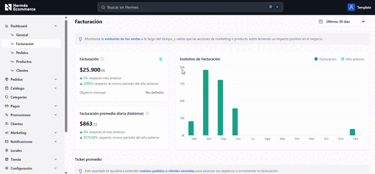
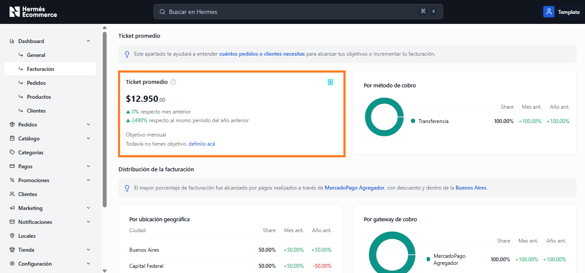
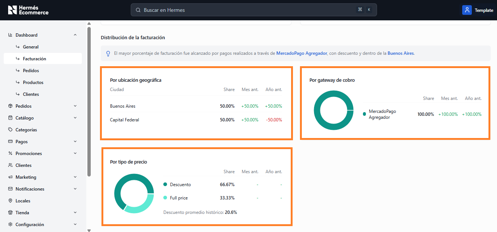

# Facturación

**URL:** `/admin/dashboard/facturacion`

Análisis detallado de la facturación del negocio con gráficos evolutivos, ticket promedio y distribuciones por distintas dimensiones.

<figure><figcaption></figcaption></figure>

## Métricas principales

| Métrica                                     | Descripcion                                                                                                            |
| ------------------------------------------- | ---------------------------------------------------------------------------------------------------------------------- |
| **Facturación**                             | Monto total del período. Variación vs mes anterior y vs mismo período del año anterior. Objetivo mensual configurable. |
| **Facturación promedio diaria (histórico)** | Promedio diario calculado sobre el período. Variación vs mes y año anterior.                                           |

## Gráfico Evolutivo de Facturación

Gráfico de barras que muestra la facturación mensual durante los últimos 12 meses. Incluye dos series para comparar con el año anterior.

<figure><figcaption></figcaption></figure>

## Ticket Promedio


Este apartado te ayudará a entender cuantos pedidos o clientes necesitas para alcanzar tus objetivos o incrementar tu facturación.


<figure><figcaption></figcaption></figure>

* **Valor del ticket promedio** con variaciones mensuales y anuales
* **Objetivo mensual** configurable (con link para definirlo si no está configurado)

## Distribución de la facturación

Se muestra un tip contextual indicando el método de pago más usado, la ciudad principal y el tipo de descuento predominante.

<figure><figcaption></figcaption></figure>

### Por gateway de cobro

Gráfico de dona mostrando la participación de cada gateway (ej: MercadoPago Agregador).&#x20;

Mismas columnas comparativas.

### Por ubicación geográfica

Tabla con las ciudades ordenadas por participación.&#x20;

Columnas: Ciudad, Share, Mes ant., Año ant.

### Por tipo de precio

Gráfico de dona que muestra la proporción entre ventas con descuento y a precio full.

Incluye el descuento promedio histórico como métrica adicional.
