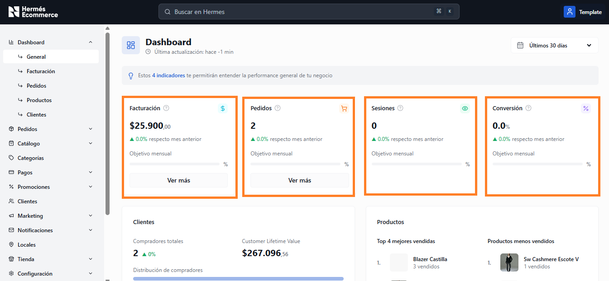
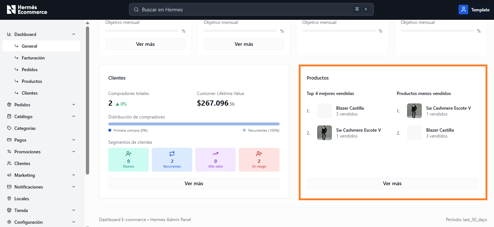

# General

**URL:** `/admin/dashboard`

Vista resumen con los 4 indicadores principales del negocio y secciones de Clientes y Productos.

<figure><figcaption></figcaption></figure>

## Indicadores principales

En la parte superior se muestran 4 tarjetas con los KPIs del período seleccionado:

| Indicador       | Descripcion                                                                                                                                                 |
| --------------- | ----------------------------------------------------------------------------------------------------------------------------------------------------------- |
| **Facturación** | 
Monto total facturado. 

Muestra variación % respecto al mes anterior. Incluye barra de progreso hacia el objetivo mensual si esta configurado.
 |
| **Pedidos**     | 
Cantidad total de pedidos. 

Variación % vs mes anterior. 

Progreso hacia objetivo mensual.
                                               |
| **Sesiones**    | Cantidad de visitas/sesiones en el período. Variación % vs mes anterior.                                                                                    |
| **Conversión**  | 
Tasa de conversión en %. 

Variación % vs mes anterior.
                                                                                         |

Cada tarjeta incluye un enlace **"Ver más"** que lleva al dashboard detallado de esa métrica.

## Sección Clientes

Muestra un resumen de la base de clientes:

<figure><figcaption></figcaption></figure>

* **Compradores totales:** Cantidad total con variación porcentual
* **Customer Lifetime Value:** Valor promedio histórico por cliente
* **Distribución de compradores:** Barra horizontal que muestra la proporción entre primera compra y recurrentes
* **Segmentos de clientes:** 4 tarjetas con colores distintivos:
  * **Nuevos** (verde): Primera compra en el período
  * **Recurrentes** (azul): Compradores que vuelven
  * **Alto valor** (naranja): LTV elevado
  * **En riesgo** (rojo): Volvieron tras +60 días sin comprar
* Botón **"Ver más"** enlaza al [Dashboard Clientes](clientes.md).

## Sección Productos

Muestra los productos más y menos vendidos:

<figure><figcaption></figcaption></figure>

* **Top 4 mejores vendidos:** Imagen, nombre y cantidad vendida
* **Productos menos vendidos:** Imagen, nombre y cantidad vendida
* Botón **"Ver más"** enlaza al [Dashboard Productos](productos.md).
