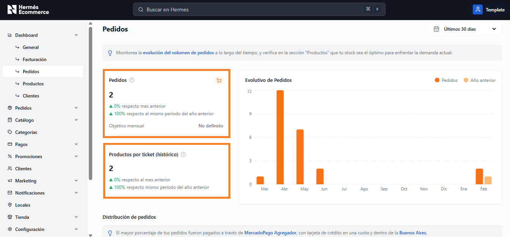
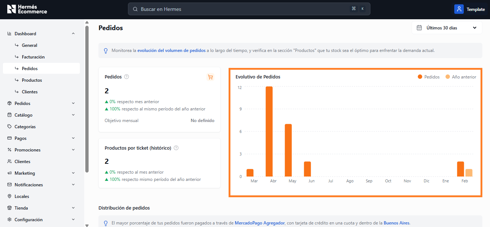
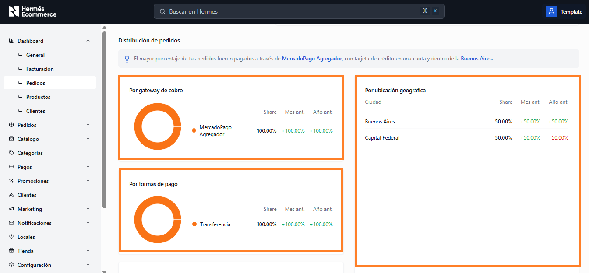

# Pedidos

**URL:** `/admin/dashboard/pedidos`

Análisis detallado del volumen de pedidos con tendencias evolutivas y distribución por distintas dimensiones.

<figure><figcaption></figcaption></figure>

## Métricas principales

<figure><figcaption></figcaption></figure>

| Metrica                              | Descripcion                                                                                                                                      |
| ------------------------------------ | ------------------------------------------------------------------------------------------------------------------------------------------------ |
| **Pedidos**                          | 
Total de pedidos del período. 

Variación vs mes anterior y vs mismo período del año anterior. 

Objetivo mensual configurable.
 |
| **Productos por ticket (histórico)** | Promedio de productos por pedido. Variaciones comparativas mensuales y anuales.                                                                  |

## Gráfico Evolutivo de Pedidos

Gráfico de barras mensual que muestra la cantidad de pedidos por mes durante los últimos 12 meses. Incluye serie comparativa con el año anterior.

<figure><figcaption></figcaption></figure>

## Distribución de pedidos

Tip contextual que indica automaticamente el gateway mas usado, la forma de pago principal y la ubicación predominante.

<figure><figcaption></figcaption></figure>

### Por gateway de cobro

Gráfico de dona con la participación de cada gateway de pago.&#x20;

Columnas: Share, variación vs Mes anterior, variación vs año anterior.

### Por ubicación geográfica

Tabla con las ciudades ordenadas por participación de pedidos.

Columnas: Ciudad, Share, Mes ant., Año ant.

### Por método de cobro

Gráfico de dona que muestra la participación de cada método de cobro (Por ej: Transferencia).&#x20;

Columnas: Share, variación vs mes anterior, variación vs año anterior.
