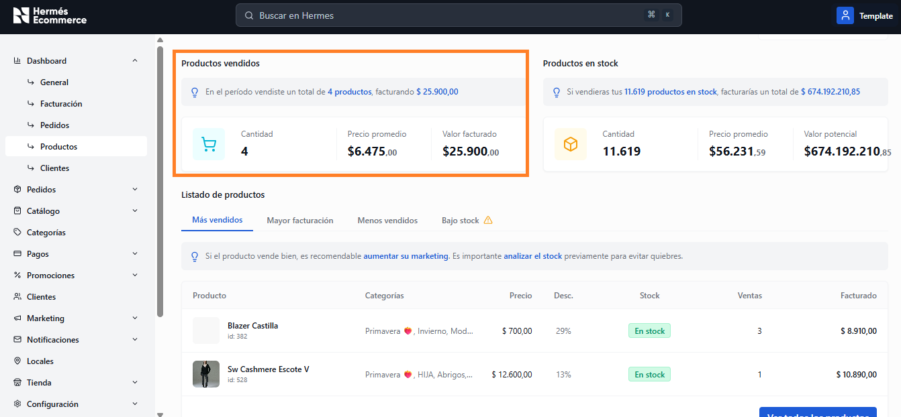
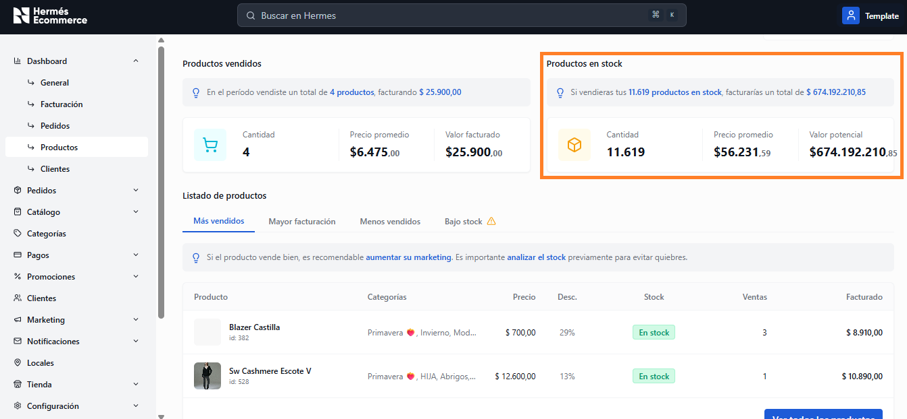
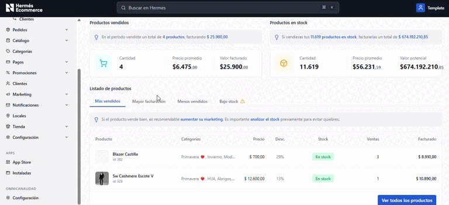
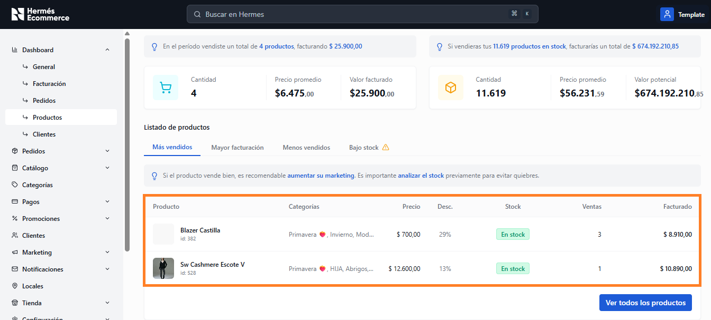

# Productos

**URL:** `/admin/dashboard/productos`

Análisis de productos vendidos y stock disponible con rankings y métricas de rendimiento.

<figure><figcaption></figcaption></figure>

## Productos vendidos

<figure><figcaption></figcaption></figure>

Tarjeta con las métricas de productos efectivamente vendidos en el período:

* **Cantidad:** Total de productos vendidos
* **Precio promedio:** Precio promedio de venta
* **Valor facturado:** Monto total facturado por productos

Adicionalmente, muestra un tip indicando el total de productos vendidos y el monto facturado. Ejemplo: _"En el período vendiste un total de X productos, facturando $Y"_

## Productos en stock

<figure><figcaption></figcaption></figure>

Tarjeta con las métricas del inventario disponible:

* **Cantidad:** Total de productos con stock
* **Precio promedio:** Precio promedio del inventario
* **Valor potencial:** Monto que se facturaría si se vendiera todo el stock

Adicionalmente, muestra un tip indicando una proyección de facturación en base al total del stock. Ejemplo: _"Si vendieras tus X productos en stock, facturarías un total de $Y"_

## Listado de productos

<figure><figcaption></figcaption></figure>

Tabla con 4 vistas filtradas por tabs:

| Tab                   | Descripción                                                                   |
| --------------------- | ----------------------------------------------------------------------------- |
| **Más vendidos**      | Ranking de productos por cantidad de ventas (default)                         |
| **Mayor facturación** | Ranking por monto facturado                                                   |
| **Menos vendidos**    | Productos con menos ventas                                                    |
| **Bajo stock**        | 
Productos con alerta de stock bajo  (ícono de advertencia amarillo)
 |

### Columnas de la tabla

<figure><figcaption></figcaption></figure>

| Columna    | Descripcion                                |
| ---------- | ------------------------------------------ |
| Producto   | Imagen thumbnail + nombre + ID             |
| Categorías | Tags de categorías asignadas               |
| Precio     | Precio en formato argentino                |
| Desc.      | Porcentaje de descuento aplicado           |
| Stock      | Badge: En stock (verde) / Sin stock (rojo) |
| Ventas     | Cantidad de unidades vendidas              |
| Facturado  | Monto facturado                            |

Botón **"Ver todos los productos"** enlaza al [catálogo de productos](../catalogo/productos/).
