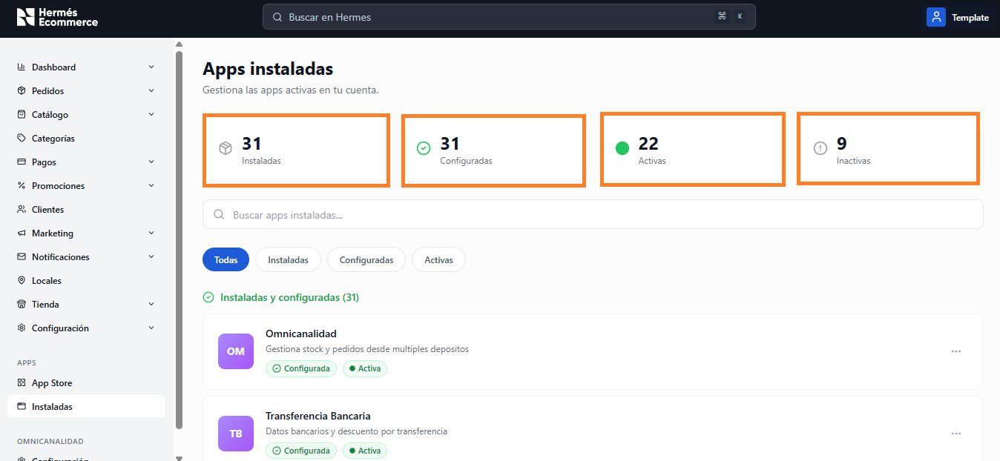
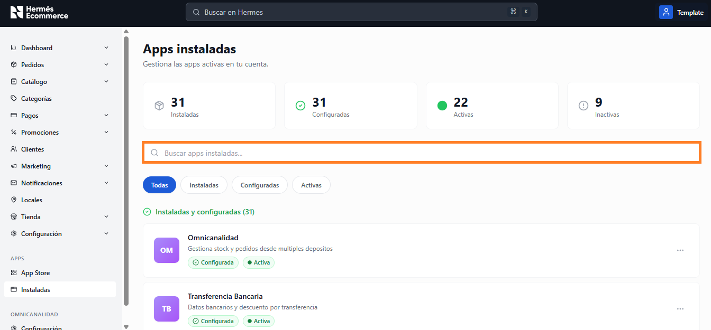
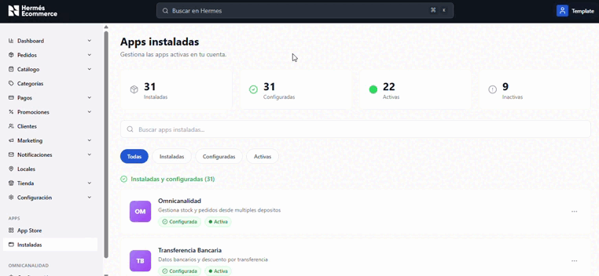
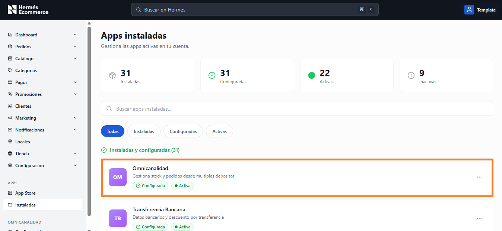

# Instaladas

**URL:** `/admin/apps`

Gestión de las apps actualmente instaladas y configuradas en la cuenta.

<figure><figcaption></figcaption></figure>

## Tarjetas de resumen

Vista resumen con los 4 indicadores principales de las apps instaladas, configuradas, activas e inactivas.

<figure><figcaption></figcaption></figure>

| Métrica          | Color       | Descripción                     |
| ---------------- | ----------- | ------------------------------- |
| **Instaladas**   | Azul        | Total de apps instaladas        |
| **Configuradas** | Verde       | Apps correctamente configuradas |
| **Activas**      | Verde (dot) | Apps en funcionamiento          |
| **Inactivas**    | Gris        | Apps instaladas pero inactivas  |

## Barra de búsqueda

Permite buscar apps instaladas por nombre.

<figure><figcaption></figcaption></figure>

## Filtros (tabs)

<figure><figcaption></figcaption></figure>

* Todas
* Instaladas
* Configuradas
* Activas

## Sección: Instaladas y configuradas

<figure><figcaption></figcaption></figure>

Lista de apps en formato card vertical:

* Ícono/logo con iniciales de color
* Nombre de la app
* Descripción
* Badges: **Configurada** (verde check), **Activa** (verde dot)
* Menú contextual (tres puntos) para acciones: Configurar, Desactivar, Desinstalar
