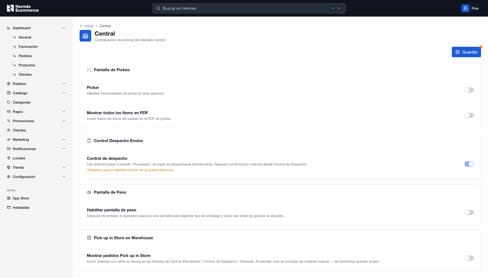

# Editar depósito central

Esta pantalla permite personalizar cómo se procesan, arman y despachan los pedidos dentro del Depósito Central. Cada interruptor activa o desactiva una regla de trabajo específica.

<figure><figcaption></figcaption></figure>

## Sección "Pantalla de Pickeo"

Permite habilitar y personalizar el flujo de validación digital para los operarios encargados del picking de productos.

* Picker: Interruptor para activar de manera exclusiva la interfaz y funcionalidad de _picker_ en este depósito. Al encenderse, el personal de bodega dispondrá de la pantalla de validación guiada para el armado de los pedidos.

<figure><figcaption></figcaption></figure>

* Mostrar todos los ítems en PDF: Opción para modificar el comportamiento de los documentos de asistencia logística. Si se activa, el sistema forzará a que el archivo PDF de picking incluya la totalidad de los ítems que componen el pedido original del cliente.

## Sección "Control Despacho Envíos"

Administra las transiciones de estado de las órdenes antes de su salida física hacia el operador logístico.

&#x20;Cuando está activo, las órdenes preparadas cambian al estado intermedio `"Procesado"` en lugar de despacharse directamente de forma automática, exigiendo una confirmación manual posterior desde el módulo de Control de Despacho.


&#x20;Obligatorio para el depósito Central. No se puede desactivar. Esta regla de negocio está fijada por defecto en el sistema para resguardar la seguridad de la operación logística central. El control visual se encuentra bloqueado nativamente.


<figure><figcaption></figcaption></figure>

## Sección "Pantalla de Peso"

Determina la obligatoriedad de un paso intermedio post-picking. Al prender este interruptor, el operador es redirigido a una interfaz específica donde debe registrar el tipo de embalaje utilizado y el peso real detectado en báscula antes de que el sistema proceda con la generación final de la etiqueta de envío.

<figure><figcaption></figcaption></figure>

<figure><figcaption></figcaption></figure>

## Sección "Pick up in Store en Warehouse"

Habilita la visibilidad e inclusión de las órdenes con modalidad de retiro en tienda física dentro de los listados operativos de Central (pestañas Pendientes, Control de Despacho e Historial).


Al prender esta opción, solo se incluyen las órdenes nuevas generadas a partir de ese instante. Las órdenes creadas de forma anterior a la activación quedan definitivamente fuera de los listados de Central.

