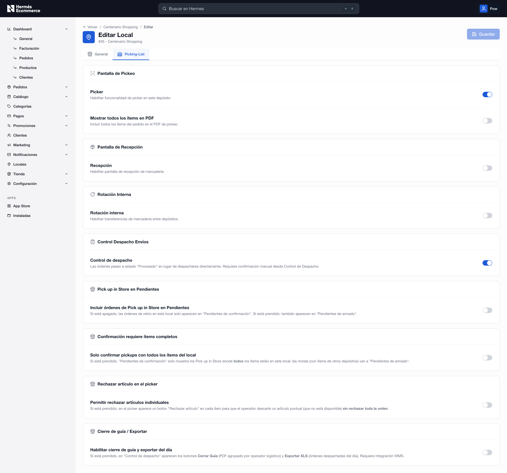

# Editar local

Esta sección permite a los administradores activar, desactivar y parametrizar las distintas funcionalidades, pantallas y reglas de control que van a regir el flujo logístico dentro del local

Cada opción se maneja mediante un interruptor (_switch_) de encendido/apagado.


Esta opción solo aparece si la app _Picking List_ ya está instalada desde **App Store**.


<figure><figcaption></figcaption></figure>

## Sección "Pantalla de Pickeo"

Permite habilitar y personalizar el flujo de validación digital para los operarios o vendedores encargados del picking de productos en el local.

* Picker: Interruptor para activar la interfaz y funcionalidad de _picker_ en este local. Al encenderse, el personal del local dispondrá de la pantalla de validación guiada mediante escaneo para el armado de los pedidos.
* Mostrar todos los ítems en PDF: Opción para modificar el comportamiento de los documentos de asistencia logística. Si se activa, el sistema forzará a que el archivo PDF de picking incluya la totalidad de los ítems que componen el pedido original del cliente.

<figure><figcaption></figcaption></figure>

## Sección "Pantalla de Recepción"

Administra el ingreso de stock y mercadería al establecimiento.

&#x20;Al prender este interruptor, se habilita la interfaz dedicada a la pantalla de recepción de mercadería, permitiendo controlar y validar físicamente los productos que ingresan al local.

<figure><figcaption></figcaption></figure>

## Sección "Rotación Interna"

Facilita los movimientos de stock entre los diferentes nodos de la empresa.

Permite habilitar el flujo y la gestión de transferencias de mercadería directamente entre depósitos o locales.

<figure><figcaption></figcaption></figure>

## Sección "Control Despacho Envíos"

Administra las transiciones de estado de las órdenes antes de su salida física del local.

Cuando está activo, las órdenes preparadas cambian al estado intermedio `"Procesado"` en lugar de despacharse de forma directa y automática, exigiendo una confirmación manual posterior desde el módulo de Control de Despacho.

<figure><figcaption></figcaption></figure>

## Sección "Pick up in Store en Pendientes"

Controla la visibilidad de las órdenes con retiro en tienda según la etapa operativa en la que se encuentren.

* Incluir órdenes de Pick up in Store en Pendientes: Modifica el destino visual de los retiros. Si está apagado, las órdenes de retiro en este local solo aparecen en la vista de "Pendientes de confirmación". Si está prendido, también se visualizarán en la cola de "Pendientes de armado".

## Sección "Confirmación requiere ítems completos"

Determina las reglas de segmentación para órdenes multi-artículo o combinadas.

Al activarse, la pantalla de "Pendientes de confirmación" solo mostrará las órdenes de Pick up in Store cuyos productos se encuentren todos físicamente en este local. Las órdenes mixtas (que incluyan ítems alojados en otros depósitos) se derivarán automáticamente a "Pendientes de armado".

## Sección "Rechazar artículo en el picker"

Flexibiliza las acciones del operario durante la preparación del pedido ante quiebres de stock.

Si se enciende, la interfaz de validación del _picker_ expondrá un botón específico de "Rechazar artículo" en cada ítem. Esto permite al operador descartar una unidad puntual que no esté disponible físicamente en la góndola, sin necesidad de cancelar o rechazar toda la orden completa.

<figure><figcaption></figcaption></figure>

### Sección "Cierre de guía / Exportar"

Habilita herramientas complementarias de despacho masivo y reportes diarios.

Al activarse, se despliegan en la pantalla de "Control de despacho" dos nuevas funciones operativas: el botón Cerrar Guía (para generar un PDF agrupado por cada operador logístico) y el botón Exportar XLS (para descargar la planilla con las órdenes despachadas en la jornada).


Esta funcionalidad requiere de manera obligatoria que la plataforma cuente con una integración activa con un sistema de gestión de almacenes (WMS).

